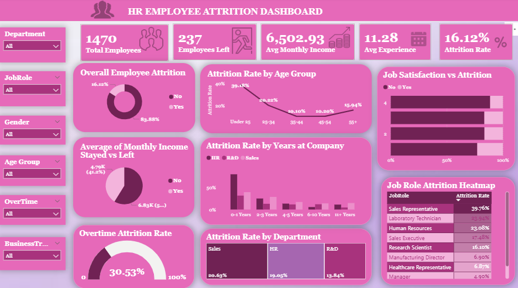

# 📊 HR Employee Attrition Analysis – Power BI

An interactive **HR Employee Attrition Dashboard** built using Power BI to analyze employee turnover and identify patterns associated with employee attrition.

The dashboard answers a key business question:

> **Why are employees leaving?**

---

## 🎯 Project Objective

The objective of this project is to analyze employee attrition across different employee and workplace factors and help HR teams identify areas that may require deeper investigation and retention strategies.

---

## 🛠️ Tools & Technologies

- **Power BI**
- **DAX**
- **Microsoft Excel / CSV**
- **Data Visualization**
- **Data Analysis**

---

## 📌 Dashboard Features

The dashboard provides an interactive view of:

- Overall Employee Attrition
- Attrition Rate by Age Group
- Attrition by Department
- Attrition by Job Role
- Job Satisfaction vs Attrition
- Attrition by Years at Company
- Overtime Attrition Rate
- Average Monthly Income – Stayed vs Left

### Interactive Slicers

Users can filter the dashboard using:

- Department
- Job Role
- Gender
- Age Group
- OverTime
- Business Travel

These filters allow users to explore specific employee segments and understand where attrition is concentrated.

---

## 🔎 Key Insights

- **16.12%** overall employee attrition.
- **237 employees** out of 1,470 have left the organization.
- Employees working **overtime** have a significantly higher attrition rate (**30.53%**).
- Employees **under 25** have the highest age-group attrition (**39.18%**).
- **Sales** has the highest department-level attrition (**20.63%**).
- **Sales Representatives** have the highest job-role attrition (**39.76%**).
- Lower job satisfaction is associated with higher attrition.
- Employees who left had a lower average monthly income than employees who stayed.
- Attrition is particularly high among employees with shorter tenure.

---

## 💼 Business Problem

High employee attrition can increase recruitment costs, training requirements, workload on existing employees, and potential loss of organizational experience.

This dashboard helps HR teams:

- Identify high-attrition departments and job roles
- Explore employee segments with higher attrition
- Investigate the relationship between overtime and attrition
- Analyze satisfaction and compensation patterns
- Support data-driven employee retention strategies

---

## 📈 Example Analysis

Using the interactive slicers, HR can drill down from the overall workforce to a specific employee segment.

For example:

**Department → Sales**  
**Job Role → Sales Representative**  
**Age Group → Under 25**  
**OverTime → Yes**

This filtered segment showed an **88.89% attrition rate**, with **8 out of 9 employees having left**.

Because the filtered group contains only 9 employees, this result should be interpreted as a **small-segment pattern requiring further investigation**, rather than a general conclusion.

---

## 📷 Dashboard Preview



---

## 📂 Project Structure

```text
HR-Employee-Attrition-PowerBI/
│
├── README.md
│
├── HR_Employee_Attrition_Dashboard.pbix
│
├── Dataset/
│   └── WA_Fn-UseC_-HR-Employee-Attrition.csv
│
├── Dashboard/
│   └── HR_Employee_Attrition_Dashboard.png
│
└── Documentation/
    └── Key_Insights.md
